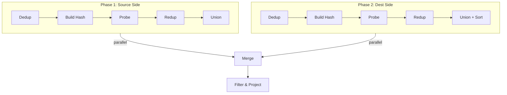

# One-Hop Algorithm

## Oblivious Graph Traversal in Secure Computation

<div class="pt-12">
  <span class="px-2 py-1 rounded cursor-pointer" hover="bg-white bg-opacity-10">
    Account → Transaction → Account
  </span>
</div>

---

# What is One-Hop?

Traverse a **single edge** in a property graph

<div class="grid grid-cols-2 gap-4 mt-8">

<div>

### Example Query
*"Find all transfers between high-balance accounts"*

```
Account(1, bal=777K) ──txn──> Account(3, bal=776K)
```

</div>

<div>

### The Challenge

<v-clicks>

- Standard hash joins **leak information**
- Adversary observes memory access patterns
- Reveals **which accounts are connected**

</v-clicks>

</div>

</div>

<v-click>

<div class="mt-8 p-4 bg-blue-500 bg-opacity-20 rounded">

**Goal**: Execute joins where access patterns are **identical** regardless of data values

</div>

</v-click>

---

# Our Running Example

<div class="grid grid-cols-3 gap-4">

<div>

### Account Table
| id | balance |
|----|---------|
| 1  | 777,572 |
| 3  | 776,646 |
| 5  | 500,000 |

</div>

<div>

### Transaction Table
| txn_id | from | to | amount |
|--------|------|----|--------|
| T1 | 1 | 3 | 12,210 |
| T2 | 1 | 5 | 6,080 |
| T3 | 3 | 5 | 13,495 |

</div>

<div>

### Query
```sql
SELECT *
FROM Account src, Txn, Account dst
WHERE src.id = Txn.from
  AND dst.id = Txn.to
  AND src.balance > 700000
  AND amount > 10000
```

</div>

</div>

---

# Algorithm Overview: Three Phases



---
layout: two-cols
---

# Phase 1: Prepare Probe Table

Create probe table with keys from **txn.acc_from**:

<v-clicks>

| key (acc_from) | txn_id | isDummy |
|----------------|--------|---------|
| 1 | T1 | false |
| 1 | T2 | false |
| 3 | T3 | false |

</v-clicks>

::right::

<v-click>

<div class="mt-12">

## ⚠️ Problem

**Duplicate keys!**

Account 1 appears twice → hash probing won't work correctly

</div>

</v-click>

<v-click>

<div class="mt-8 p-4 bg-yellow-500 bg-opacity-20 rounded">

**Solution**: Deduplication

</div>

</v-click>

---

# Step 1: Deduplication (Oblivious)

Mark duplicate keys as **dummy** and assign random keys:

```cpp {all|2-3|4-5}
for each row i:
    if key[i] == key[i-1]:        // Duplicate detected
        key[i] = random()          // Assign random key
        isDummy[i] = true          // Mark as dummy
    lastKey = key[i]
```

<v-click>

<div class="grid grid-cols-2 gap-8 mt-8">

<div>

### Before
| key | txn_id | isDummy |
|-----|--------|---------|
| 1 | T1 | false |
| **1** | T2 | false |
| 3 | T3 | false |

</div>

<div>

### After
| key | txn_id | isDummy |
|-----|--------|---------|
| 1 | T1 | false |
| **7382941** | T2 | **true** |
| 3 | T3 | false |

</div>

</div>

</v-click>

<v-click>

→ **All keys now unique** for hash probing!

</v-click>

---

# Step 2: Build Hash Table

Build chained hash table from **Account** table:

```cpp
bucket_size = 4  // power of 2
for each account:
    idx = hash(account_id) % bucket_size
    next[i] = bucket[idx]
    bucket[idx] = i + 1
```

<v-click>

<div class="mt-8">

```
Bucket[0] → ∅
Bucket[1] → Account(id=1, bal=777K) → ∅
Bucket[2] → ∅
Bucket[3] → Account(id=3, bal=776K) → Account(id=5, bal=500K)
```

</div>

</v-click>

---

# Step 3: Probe (Oblivious)

The **key innovation**: Use `ObliviousChoose` instead of if-else

```cpp {all|4-8|10-11}
for each probe_row:
    idx = hash(probe_row.key)
    match = 0

    for hit in bucket_chain[idx]:
        // ALWAYS evaluates both branches - no conditional jump!
        match = ObliviousChoose(
            Account[hit].id == probe_row.key,  // condition
            hit,                                // value if true
            match                               // value if false
        )

    // Copy matched data (or dummy if isDummy)
    probe_row.data = ObliviousChoose(
        probe_row.isDummy, dummyRow, Account[match]
    )
```

---
layout: two-cols
---

# After Probing

| key | txn_id | isDummy | account_id | balance |
|-----|--------|---------|------------|---------|
| 1 | T1 | false | 1 | 777,572 |
| 7382941 | T2 | **true** | *(dummy)* | *(dummy)* |
| 3 | T3 | false | 3 | 776,646 |

::right::

<v-click>

<div class="mt-12">

## ⚠️ Problem

Row T2 has **dummy data**

But it needs Account 1's data (same as T1)!

</div>

</v-click>

<v-click>

<div class="mt-8 p-4 bg-yellow-500 bg-opacity-20 rounded">

**Solution**: Reduplication

</div>

</v-click>

---

# Step 4: Reduplication (Oblivious)

Copy previous row's data to dummy rows:

```cpp {all|3-4|5}
lastRow = empty
for each row i:
    // If dummy, take lastRow's data; otherwise keep current
    row[i] = ObliviousChoose(row[i].isDummy, lastRow, row[i])
    row[i].txn_id = original_txn_id  // Restore transaction reference
    lastRow = row[i]
```

<v-click>

<div class="mt-8">

### After Reduplication

| txn_id | isDummy | account_id | balance |
|--------|---------|------------|---------|
| T1 | false | 1 | 777,572 |
| T2 | false | **1** | **777,572** | ← Copied from T1!
| T3 | false | 3 | 776,646 |

</div>

</v-click>

---

# Step 5: Union with Edge Table

Combine transaction columns with matched Account columns:

<div class="mt-8">

| txn_id | acc_from | acc_to | amount | **src_id** | **src_balance** |
|--------|----------|--------|--------|------------|-----------------|
| T1 | 1 | 3 | 12,210 | 1 | 777,572 |
| T2 | 1 | 5 | 6,080 | 1 | 777,572 |
| T3 | 3 | 5 | 13,495 | 3 | 776,646 |

</div>

<v-click>

<div class="mt-8 p-4 bg-green-500 bg-opacity-20 rounded">

✅ **Source side complete!** Each transaction now has source account info.

</div>

</v-click>

---

# Phase 2: Destination Side (Parallel)

Same process with **txn.acc_to** as key:

<div class="grid grid-cols-2 gap-4 mt-8">

<div>

### Input (sorted by acc_to)
| txn_id | acc_to |
|--------|--------|
| T1 | 3 |
| T2 | 5 |
| T3 | 5 |

</div>

<div>

### After Dedup → Probe → Redup → Union
| txn_id | **dst_id** | **dst_balance** |
|--------|------------|-----------------|
| T1 | 3 | 776,646 |
| T2 | 5 | 500,000 |
| T3 | 5 | 500,000 |

</div>

</div>

<v-click>

<div class="mt-8">

### Additional Step: Sort by txn_id
Ensures alignment with source side for merging

</div>

</v-click>

---

# Phase 3: Merge Results

Combine source and destination sides:

| txn_id | from | to | amount | src_bal | dst_bal |
|--------|------|-----|--------|---------|---------|
| T1 | 1 | 3 | 12,210 | 777,572 | 776,646 |
| T2 | 1 | 5 | 6,080 | 777,572 | 500,000 |
| T3 | 3 | 5 | 13,495 | 776,646 | 500,000 |

<v-click>

### Apply Filter: `src_balance > 700,000 AND amount > 10,000`

| txn_id | src_bal > 700K? | amount > 10K? | **Result** |
|--------|-----------------|---------------|------------|
| T1 | ✅ 777K | ✅ 12,210 | **KEEP** |
| T2 | ✅ 777K | ❌ 6,080 | discard |
| T3 | ✅ 776K | ✅ 13,495 | **KEEP** |

</v-click>

---

# Final Output

<div class="mt-12 text-center">

| src_account | dst_account | amount |
|-------------|-------------|--------|
| 1 | 3 | 12,210 |
| 3 | 5 | 13,495 |

</div>

<v-click>

<div class="mt-12 p-6 bg-blue-500 bg-opacity-20 rounded text-center">

## 🔒 Obliviousness Guaranteed

The memory access pattern is **identical** whether:
- 0 rows match or all rows match
- High-value accounts transfer or low-value accounts

**Adversary learns nothing about which accounts are connected!**

</div>

</v-click>

---

# Why Dedup + Redup?

<div class="grid grid-cols-2 gap-8 mt-8">

<div>

### The Problem

Hash probing requires **unique keys**

But sorted edge tables have **duplicates**:
- Multiple txns from same account
- Multiple txns to same account

</div>

<div>

### The Solution

1. **Dedup**: Assign random keys to duplicates
   - All keys unique → hash works

2. **Probe**: Each unique key finds match once

3. **Redup**: Copy results to duplicate rows
   - All rows get correct data

</div>

</div>

<v-click>

<div class="mt-8 p-4 bg-green-500 bg-opacity-20 rounded text-center">

**Access pattern identical** regardless of duplicate count!

</div>

</v-click>

---

# Operation Summary

| Step | Operation | Why Oblivious? |
|------|-----------|----------------|
| 1 | **Deduplication** | Always scans all rows, no branches |
| 2 | **Build** | Standard hash table construction |
| 3 | **Probe** | `ObliviousChoose` - no conditional branches |
| 4 | **Reduplication** | Always copies, decides value obliviously |
| 5 | **Union** | Column concatenation, no data dependency |
| 6 | **Sort** | Oblivious sort (e.g., bitonic sort) |
| 7 | **Filter** | Mark as dummy, don't delete |

<v-click>

<div class="mt-8 p-4 bg-blue-500 bg-opacity-20 rounded">

**Key Primitive**: `ObliviousChoose(cond, A, B)`
- Always evaluates both A and B
- Returns A if cond=true, B otherwise
- No conditional memory access!

</div>

</v-click>

---
layout: center
class: text-center
---

# Questions?

<div class="mt-8">

Account → Transaction → Account

**Oblivious One-Hop Join**

</div>
